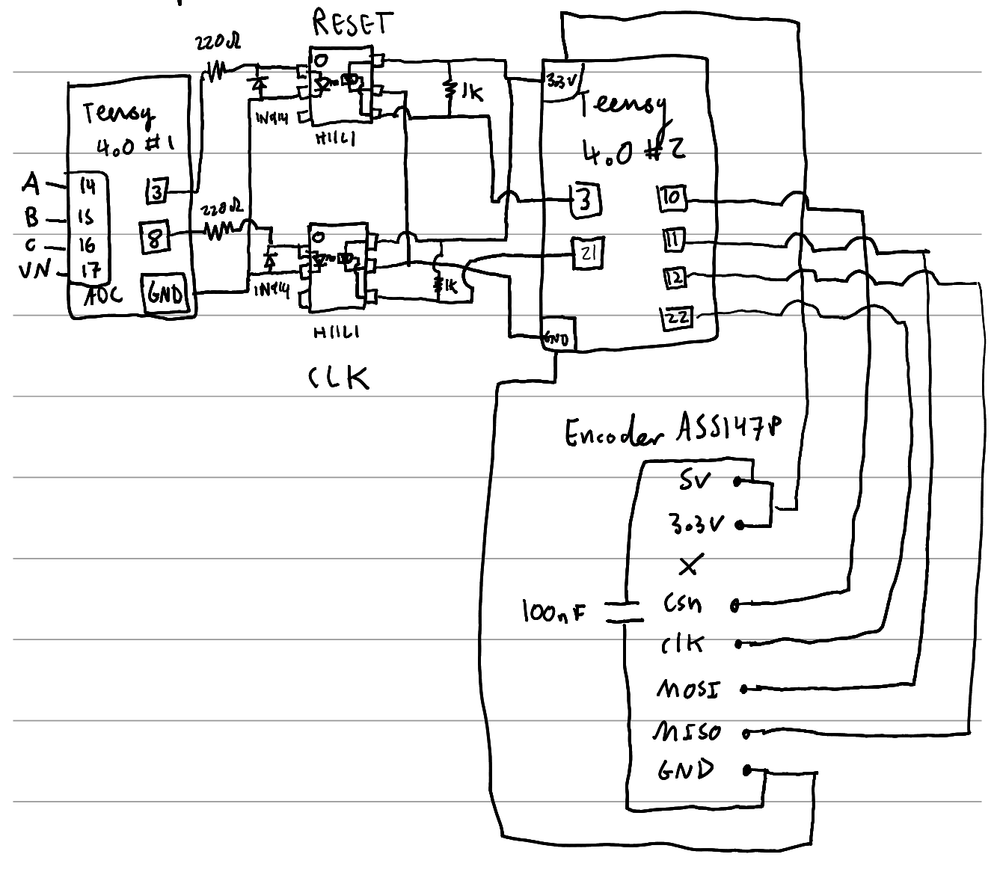

# Galvanically isolated ADC/Encoder circuit

# Connecting to JK-SBDLC-SMT-REV2. 

## ADC/ADC-ETC information table:

| PHASE       | A   | B      | VN    | C     |
|-------------|-----|--------|-------|-------|
| Teensy 4.0 #1 pin         | 14  | 15     | 17    | 16    |
| COLOUR      | RED | YELLOW | GREEN | BLACK |
| TRIG        | 0   | 1      | 2     | 3     |
| DONE        | 0   | 1      | 0     | 1     |
| HW-CH       | 1   | 2      | 3     | 4     |
| ADC-CH      | 7   | 8      | 11    | 12    |

## Other pins

- Connect Teensy 4.0 #1 ground to pin 7 of JK-SBDLC-SMT-REV2.

# Connecting to AS5147.

# Encoder information table:

AS5147 pin| 5v| 3.3v| x| csn| clk| mosi| miso| GND
:-----:|:-----:|:-----:|:-----:|:-----:|:-----:|:-----:|:-----:|:-----:
Teensy 4.0 #2 pin| 3.3v| 3.3v| x| 10| 22| 11| 12| GND

# Connecting Teensy 4.0 #1 with Teensy 4.0 #2 with two H11L1 optocouplers.

Teensy 4.0 #1 acts as a master and sends signals via two galvanically isolated optocouplers to Teensy 4.0 #2. 

# Connection information table:

H11L1 #1 RESET pin| 1 (ANODE)| 2 (CATHODE)| 3(NC)| 4(Vo)| 5 (GND)| 6(VCC)
:-----:|:-----:|:-----:|:-----:|:-----:|:-----:|:-----:
Teensy 4.0 #1 pin| 3| GND| X| X| X| X
Teensy 4.0 #2 pin| X| X| X| 3| GND| 3.3V

H11L1 #2 CLK pin| 1 (ANODE)| 2 (CATHODE)| 3(NC)| 4(Vo)| 5 (GND)| 6(VCC)
:-----:|:-----:|:-----:|:-----:|:-----:|:-----:|:-----:
Teensy 4.0 #1 pin| 8| GND| X| X| X| X
Teensy 4.0 #2 pin| X| X| X| 7| GND| 3.3V

# Collecting ADC/Encoder data for calibration instructions.

Need two computers to collect clean data from this setup. One needs to be a laptop (computer #1) which is disconnected from everything, networking via wifi nessesary.

1. Modify zero_crossing_adc.ino and set the PWM_FREQUENCY to full calibration logging speed e.g. 90kHz.
2. Make sure zero_crossing_adc.ino has been loaded onto the Teensy 4.0 #1.
3. Make sure zero_crossing_encoder_slave.ino has been loaded onto the Teensy 4.0 #2.
4. Find network address of computer #1 and computer #2 by running `ifconfig` or similar. e.g. '192.168.0.15'.
5. Plug Teensy 4.0 #2 (Encoder) into computer #2.
6. Plug Teensy 4.0 #1 (ADC) into computer #1 (needs to be a fully charged laptop disconnected from everything else apart from the Teensy [not ethernet allowed]).
7. Unplug and replug Teensy 4.0 #1 into computer #1 (forcing a reset).
8. Start the network sync program on computer #1 and provide a name for this data collection run e.g. 'aug_18_test_1'. `npm run network-serial:collect-sync --run_id=aug_18_test_1`. 
9. SSH to computer #2.
10. Start the network source program on computer #2. `npm run network-serial:collect-source --device_id=1 --sync_host=192.168.0.15` .
11. Use a power drill to spin the motor at a constant high angular velocity.
12. Start the network source program on computer #1. `npm run network-serial:collect-source --device_id=0 --sync_host=0.0.0.0` .
13. After you are happy enough data has been collected stop collection by unplugging Teensy 4.0 #1.
14. Ensure `network-serial:collect-source` is stopped for both computers. By typing `Ctrl-c` into the relevant terminal sessions.
15. At this point the `network-serial:collect-sync` will merge the dataset and create an output file `./datasets/data/calibration-data/[run_id].jsonl` on computer #1. [If this does not work try manually merging the files. See below].
16. Combine the collected `./datasets/data/calibration-data/[run_id].jsonl` file `npm run combine:rotation-voltage-network-data --dataset=[run_id].jsonl`, you will recieve a file `[run_id].jsonl.matched.csv` in the `./datasets/data/calibration-data/` folder if successful, this program will report how well it matched records, high match rate is expect ~98% for good runs.
17. Inspect the `./datasets/data/calibration-data/[run_id].jsonl.matched.csv` file using the command and tune the kalman settings at the top (trial and error if nessesary, looking for kalman closely following the signal without to much noise).
    - `npm run inspect:rotation-voltage-data --dataset=[run_id].jsonl.matched.csv`
18. When you are happy with the quality of the kalman data you can proceed to detecting the zero crossing.
    - `npm run smooth:rotation-voltage-data --dataset=[run_id].jsonl.matched.csv`
19. Next take the smoothed network data and attempt to cluster it `npm run detect:zero-crossing --dataset=[run_id].jsonl.matched.csv`.

# Manually merging the datasets if network merge fails:

1. Each source program will write to the `/tmp` folder before network transmission is attempted. Take the `/tmp/serial-data-device-[x].jsonl` file from the `/tmp` folder's from each computer and place into a folder under `./datasets/data/calibration-data/[experiment-name]/` of computer #1.
2. Combine datasets into a single file `node calibration/combine-multicapture-files.js [experiment-name]`
3. Rename the resultant file the same name as the experiment name `[experiment-name].jsonl` and move to parent folder.
4. Combine the collected `[experiment-name].jsonl` `npm run combine:rotation-voltage-network-data --dataset=[experiment-name].jsonl`, you will recieve a file `[experiment-name].jsonl.matched.csv` if the successful, this program will report how successful it was in matching records high match rate is expect ~98%.
5. Proceed from step 16 from the calibration instructions.

[Good ADC capture with Kalman filtering example output of inspect:rotation-voltage-data](../calibration/inspect-zero-crossing-results.pdf)

# Troubleshooting:

- Permission denied when trying to run `network-serial:collect-source`
  - Change permissions for Teensy device `sudo chmod a+rw /dev/ttyACM0`
- One voltage channel 's(A,B,C) peak (in inspect) is larger than the other one.
  - Check circuit connections
  - Disconnect laptop from mains.

# Documentation
Requires running `npm run generate:docs`

-  [JS Docs](../docs/global.html)

# Component Information

## JK-SBDLC-SMT-REV2

- [Electrical design](../design/electrical)

## H11L1 Opto-isolator

- [Datasheet](https://www.mouser.com/datasheet/2/149/H11L1M-1010369.pdf)

## AS5147P Encoder

- [Datasheet](https://ams.com/documents/20143/36005/AS5147P_DS000328_2-00.pdf)
