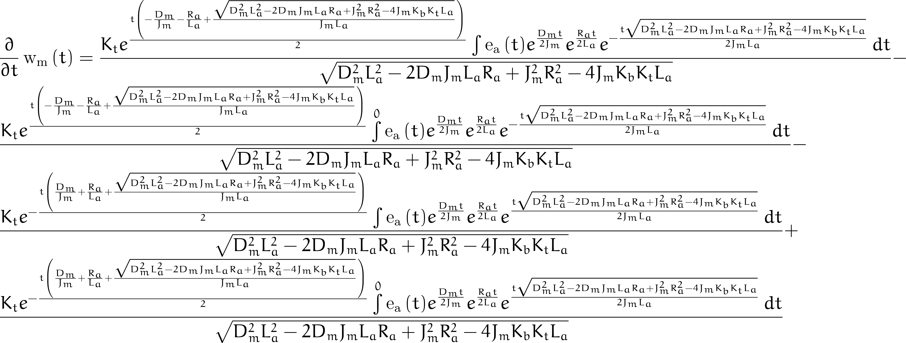

# Physical model from simplified circuit Kirchoff + Newton

# [Derivation](control-BLDC.pdf)

#

# Terms

$$
\begin{align}
J_m = \textnormal{motor inertia vs torque coefficient} \newline
R_a = \textnormal{armature resistance} \newline
K_b = \textnormal{back-emf vs angular velocity coefficient} \newline
K_t = \textnormal{torque vs current coefficient} \newline
D_m = \textnormal{viscous damping term} \newline
L_a = \textnormal{armature inductance}
\end{align}
$$

#

# Differential equation

#

# Solution according to Sympy

Notes: Bounds are incomplete!
#

# First derivative of solution according to Sympy

Notes: First derivative appears identical to the ode solution w(t), think this is clear wrong, would expect perhaps
to see a term for de_a(t)/dt. Perhaps that does not appear as eliminated via doing IBP Su'v = uv - Sv'u
#
