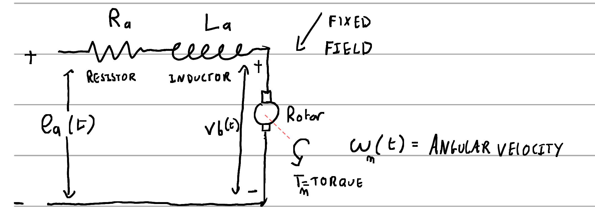
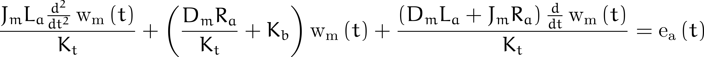
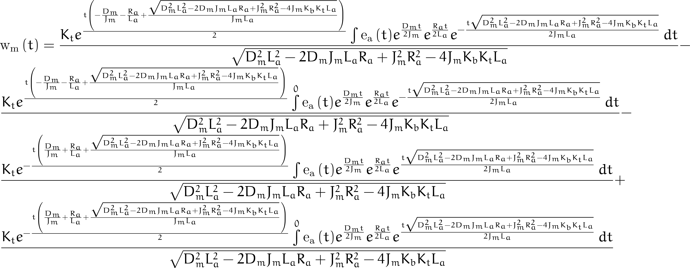

# Physical model from simplified circuit Kirchoff + Newton

# Terms

$$
J_m = \textnormal{motor inertia vs torque coefficient} \newline
R_a = \textnormal{armature resistance} \newline
K_b = \textnormal{back-emf vs angular velocity coefficient} \newline
K_t = \textnormal{torque vs current coefficient} \newline
D_m = \textnormal{viscous damping term} \newline
L_a = \textnormal{armature inductance}
$$

# Differential equation

# Solution

# [Derivation](control-BLDC.pdf)

