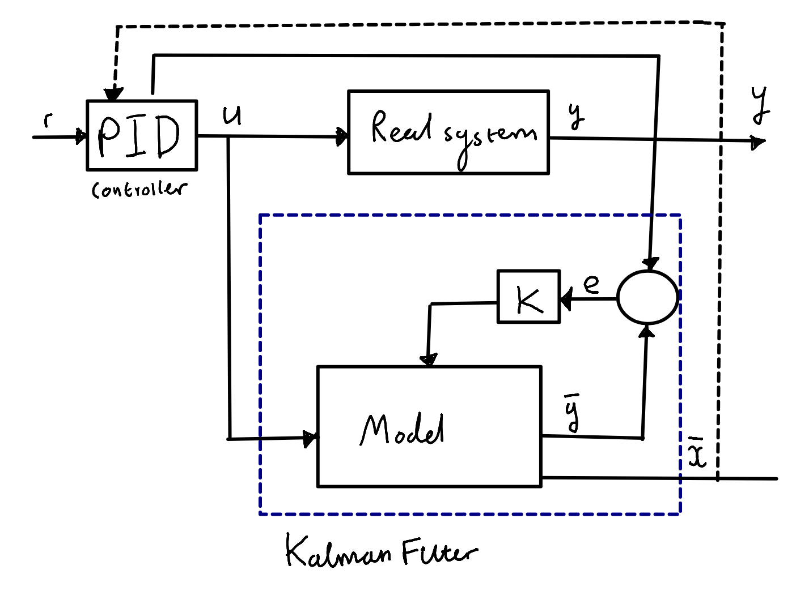

### Control

Control will be achieved by setting targets for angular velocity, acceleration and jerk (3rd derivative) and utalising a PID circuit to modify the motors duty cycle to compensate for dynamic and systematic drag, maintaining a precise angular velocity and achieving that speed with grace.

- [Velocity_PID](https://deltamotion.com/support/webhelp/rmctools/Controller_Features/Control_Modes/Velocity_PID.htm)
- [Position PID](https://www.techbriefs.com/component/content/article/tb/supplements/mcat/features/articles/18803)
- [Tuning PID control parameters with a Kalman filter](https://folk.ntnu.no/skoge/prost/proceedings/PID-2018/0064.PDF)

## Optimisation / smoothing

- [Improving the Angular Velocity Measured with a Low-Cost Magnetic Rotary Encoder Attached to a Brushed DC Motor by Compensating Magnet and Hall-Effect Sensor Misalignments](https://www.mdpi.com/1424-8220/21/14/4763)
