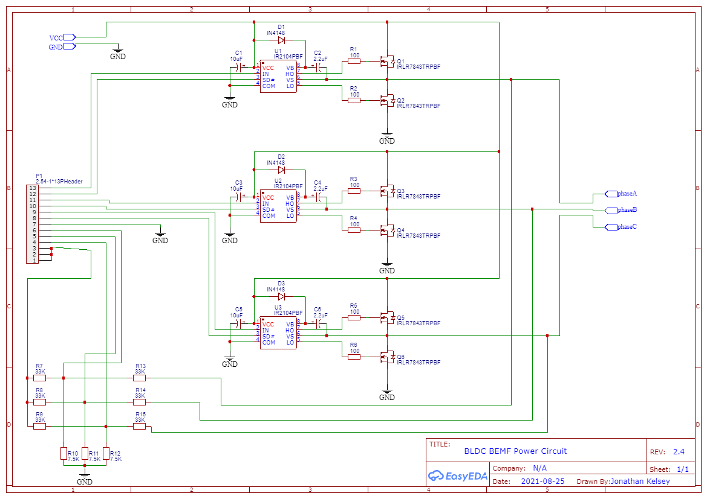
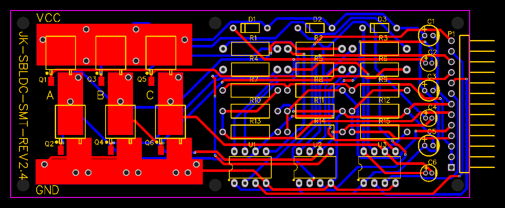

# Electrical Design

# Circuit

# Credits

This circuit was inspired greatly by the following arduino project: https://simple-circuit.com/arduino-sensorless-bldc-motor-controller-esc/
the circuit is largely the same but for some newer available transistors and a modified BEMF voltage dividing grid to offer greater protection for teensy40(which is only 3v capable) when using larger motors.

# PCB

The circuit has a male 13 pin header. Here is the configuration P1-x of the power circuit:

	- P1-13 (A_IN)
	- P1-12 (A_SD)
	- P1-11 (B_IN)
	- P1-10 (B_SD)
	- P1-09 (C_IN)
	- P1-08 (C_SD)
	- P1-07: TEENSY/ARD GND
	- P1-06 (Phase A voltage divider signal)
	- P1-05 (Phase B voltage divider signal)
	- P1-04 (Phase C voltage divider signal)
	- P1-03 (Virtual neutral voltage divider signal)
	- P1-02 (Virtual neutral voltage divider signal)
	- P1-01 (Virtual neutral voltage divider signal)

